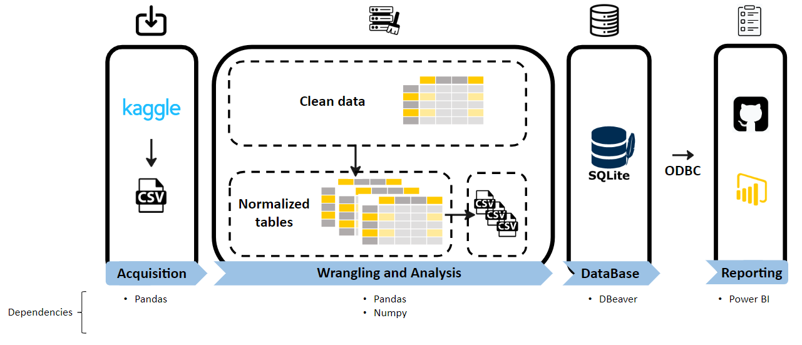

# Healthcare project 
Welcome to this project designed to analyze data from the USA healthcare system. The dataset used is a synthetic healthcare dataset designed to mimic real-world healthcare data. This dataset does not contain real information.

### 🎯 The project description
The objective of this project is to obtain a dashboard with which to represent and analyze different metrics and KPIs of this dataset. In this way to study and be able to draw conclusions about this data. 

### 📑 Dataset
Data downloaded from Kaggle: https://www.kaggle.com/datasets/prasad22/healthcare-dataset/data
The data is downloaded as a '.csv' file in a single unnormalized table. 

### 🚀 Pipeline
The high-level pipeline can be seen in the schematic below. Subsequently, the different phases carried out are described: 

The data downloaded from Kaggle are imported into the script to perform different transformations and prepare them for further work:
- Data cleaning.
- The downloaded table comes without normalization, so we proceed to normalize in different tables, to later create the data model.
- The tables are processed, creating some new columns that are necessary and then facilitate the representation of data.
- Each table is saved in a '.csv' file.
- The database is created using SQlite.
- The tables are created using SQlite in DBeaver.
- The data stored in the '.csv' files are imported to DBeaver.
- The star data model is created.
- An ODCB SQlite connector is used to import the created database into Power BI Desktop (http://www.ch-werner.de/sqliteodbc/sqliteodbc_w64.exe).
- The different representations are made through this software. The dashboard is based on this mockup:

### 🧠 Data Model
The star data model consists of 6 tables. The schematic is shown below:

### 💻 Technology stack
- Python==3.9.18
  - pandas==2.1.1
  - numpy==1.26.0
- DBeaver==23.3.2
- Power BI==2.124.1554.0

### 📁 Folder structure
    ├── .gitignore
    ├── README.md
    ├── LICENSE
    ├── img
    ├── main.py
    ├── modules
    |   ├── read_data.py
    |   ├── clean_data.py
    |   ├── normalization.py
    |   ├── processing_tables.py
    |   ├── store_tables.py
    |   └── create_tables.sql
    ├── notebooks
    |   └── normalize_data.py
    ├── bi
    |   └── healthcare.pbix
    └── data
        ├── raw_data
        |   └── healthcare_dataset.csv
        ├── normalized_data
        |   ├── df_doctors.csv
        |   ├── df_hospital.csv
        |   ├── df_medication.csv
        |   ├── df_patients.csv
        |   └── df_provider.csv
        └── healthcare.db

### 👀Context
This is the final project of module 2 for the Ironhack Part Time Data Analytics Bootcamp. The requirements can be found in the readme of the following repository:
https://github.com/CarlosSanchezVicente/ih_datamadpt0923_project_m2

### 📨 Contact info
If you have some question, drop me a line! (sanchezvicentecarlos@gmail.com).